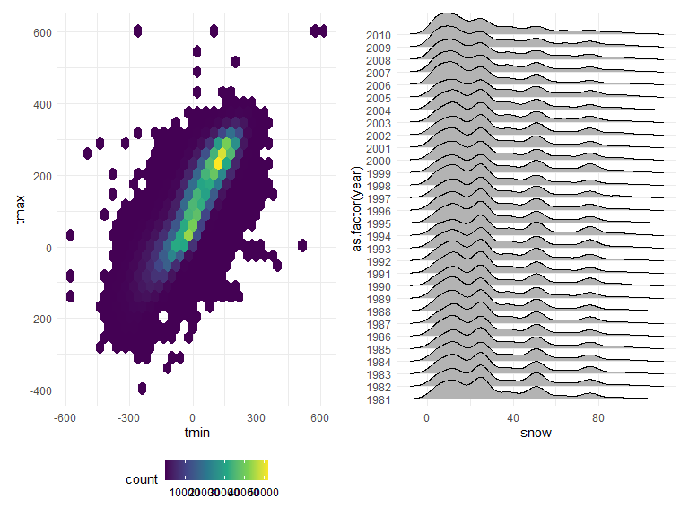

p8105_hw3_ej2520
================
Erynne Jackson
2024-10-14

## PROBLEM 1: Inspecting the “ny_noaa” Dataset

``` r
data("ny_noaa")
```

This dataset contains 2,595,176 observations and 7 variables. The
variables include station id, date, precipitation, snowfall, snow depth,
and the minimum and maximum temperatures. Next, we are going to create
separate variables for year, month, and day and make are that the
variables are in reasonable units.

0 is the most commonly observed values for snowfall.

``` r
ny_noaa %>% 
  count(snow) %>%
  arrange(desc(n))
```

    ## # A tibble: 282 × 2
    ##     snow       n
    ##    <int>   <int>
    ##  1     0 2008508
    ##  2    NA  381221
    ##  3    25   31022
    ##  4    13   23095
    ##  5    51   18274
    ##  6    76   10173
    ##  7     8    9962
    ##  8     5    9748
    ##  9    38    9197
    ## 10     3    8790
    ## # ℹ 272 more rows

``` r
ny_noaa = 
  ny_noaa %>% 
  separate(date, into = c("year", "month", "day"), convert = TRUE) %>% 
  mutate(
    tmax = as.numeric(tmax),
    tmin = as.numeric(tmin))
```

Now, we are creating a two-panel plot showing the average max
temperature in January and July in each station across the years. The
mean temperature in January is much lower than the mean temperatures in
July. The stations seem to follow similar trends in temperature across
the years, in the given month. We do see a few outliers in the late
1980s across January and July.

``` r
ny_noaa %>% 
  group_by(id, year, month) %>% 
  filter(month %in% c(1, 7)) %>% 
  summarize(mean_tmax = mean(tmax, na.rm = TRUE, color = id)) %>% 
  ggplot(aes(x = year, y = mean_tmax, group = id)) + geom_point() + geom_path() +
  facet_grid(~month) +
  labs(title = "Mean monthly temperature for each station across years for January and July")
```

    ## `summarise()` has grouped output by 'id', 'year'. You can override using the
    ## `.groups` argument.


Below is the two-panel plot showing the minimum and maximum temperatures
for the full dataset and the plot showing the distribution of snowfall
values greater than 0 and less than 100 separately by each year.

``` r
hex = 
  ny_noaa %>% 
  ggplot(aes(x = tmin, y = tmax)) + 
  geom_hex()

ridge = 
  ny_noaa %>% 
  filter(snow < 100, snow > 0) %>%
  ggplot(aes(x = snow, y = as.factor(year))) + 
  geom_density_ridges()

hex + ridge
```

    ## Picking joint bandwidth of 3.76


