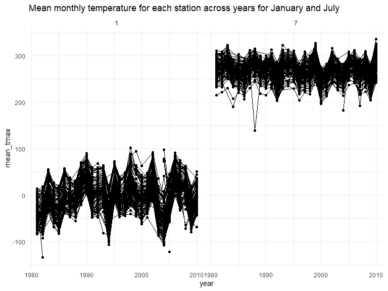

p8105_hw3_ej2520
================
Erynne Jackson
2024-10-14

## PROBLEM 1: Inspecting the “ny_noaa” Dataset

``` r
data("ny_noaa")
```

This dataset contains 2,595,176 observations and 7 variables. The
variables include station id, date, precipitation, snowfall, snow depth,
and the minimum and maximum temperatures. Next, we are going to create
separate variables for year, month, and day and make are that the
variables are in reasonable units.

0 is the most commonly observed values for snowfall.

``` r
ny_noaa %>% 
  count(snow) %>%
  arrange(desc(n))
```

    ## # A tibble: 282 × 2
    ##     snow       n
    ##    <int>   <int>
    ##  1     0 2008508
    ##  2    NA  381221
    ##  3    25   31022
    ##  4    13   23095
    ##  5    51   18274
    ##  6    76   10173
    ##  7     8    9962
    ##  8     5    9748
    ##  9    38    9197
    ## 10     3    8790
    ## # ℹ 272 more rows

``` r
ny_noaa = 
  ny_noaa %>% 
  separate(date, into = c("year", "month", "day"), convert = TRUE) %>% 
  mutate(
    tmax = as.numeric(tmax),
    tmin = as.numeric(tmin))
```

Now, we are creating a two-panel plot showing the average max
temperature in January and July in each station across the years. The
mean temperature in January is much lower than the mean temperatures in
July. The stations seem to follow similar trends in temperature across
the years, in the given month. We do see a few outliers in the late
1980s across January and July.

``` r
ny_noaa %>% 
  group_by(id, year, month) %>% 
  filter(month %in% c(1, 7)) %>% 
  summarize(mean_tmax = mean(tmax, na.rm = TRUE, color = id)) %>% 
  ggplot(aes(x = year, y = mean_tmax, group = id)) + geom_point() + geom_path() +
  facet_grid(~month) +
  labs(title = "Mean monthly temperature for each station across years for January and July")
```

    ## `summarise()` has grouped output by 'id', 'year'. You can override using the
    ## `.groups` argument.



Below is the two-panel plot showing the minimum and maximum temperatures
for the full dataset and the plot showing the distribution of snowfall
values greater than 0 and less than 100 separately by each year.

``` r
hex = 
  ny_noaa %>% 
  ggplot(aes(x = tmin, y = tmax)) + 
  geom_hex()

ridge = 
  ny_noaa %>% 
  filter(snow < 100, snow > 0) %>%
  ggplot(aes(x = snow, y = as.factor(year))) + 
  geom_density_ridges()

hex + ridge
```

    ## Picking joint bandwidth of 3.76


## PROBLEM 2: Accelometer Dataset

``` r
demo_df = read_csv("nhanes_covar.csv", 
 col_types = cols("numeric", "character", "numeric", "numeric", "character"),
 na = c(".", "NA", ""))|>
  janitor::clean_names() |> 
  rename(SEQN = x1, sex = x1_male, age = x3, BMI = x4, education = x1_less_than_high_school) |>
  filter(age >= 21) |> 
  mutate(
    sex = replace(sex, sex ==1, "male")) |> 
  mutate( 
    sex = replace(sex, sex==2, "female")) |>
  mutate( 
    education = replace(education, education == 1, "Less than high school")) |>
  mutate(
    education = replace(education, education == 2, "High school equivalent")) |> 
  mutate(
    education = replace(education, education ==3, "More than high school"))
```

    ## New names:
    ## • `` -> `...1`
    ## • `` -> `...3`
    ## • `` -> `...4`

``` r
demo_df <- demo_df[-c(1:4),]
```

Now, we are going to clean and tidy the Accelerometer dataset.

``` r
accel_df = read_csv("nhanes_accel.csv", 
  na = c(".", "NA", "")) |>
  pivot_longer(
    min1:min1440, 
    names_to = "minutes",
    names_prefix = "min", 
    values_to = "MIMS_unit"
  )
```

    ## Rows: 250 Columns: 1441
    ## ── Column specification ────────────────────────────────────────────────────────
    ## Delimiter: ","
    ## dbl (1441): SEQN, min1, min2, min3, min4, min5, min6, min7, min8, min9, min1...
    ## 
    ## ℹ Use `spec()` to retrieve the full column specification for this data.
    ## ℹ Specify the column types or set `show_col_types = FALSE` to quiet this message.

Merging participant and accelerometer dataset.

``` r
anti_join(demo_df, accel_df, by ="SEQN")
```

    ## # A tibble: 0 × 5
    ## # ℹ 5 variables: SEQN <dbl>, sex <chr>, age <dbl>, BMI <dbl>, education <chr>

``` r
anti_join(accel_df, demo_df, by ="SEQN")
```

    ## # A tibble: 33,120 × 3
    ##     SEQN minutes MIMS_unit
    ##    <dbl> <chr>       <dbl>
    ##  1 62161 1           1.11 
    ##  2 62161 2           3.12 
    ##  3 62161 3           1.47 
    ##  4 62161 4           0.938
    ##  5 62161 5           1.60 
    ##  6 62161 6           0.145
    ##  7 62161 7           2.10 
    ##  8 62161 8           0.509
    ##  9 62161 9           1.63 
    ## 10 62161 10          1.20 
    ## # ℹ 33,110 more rows

``` r
gbb_df = 
full_join(demo_df, accel_df, by = "SEQN")
```

Creating table for education by sex and visualization of age
distribution for men and women in each education category.

``` r
gbb_df |> 
  group_by(sex, education) |> 
  summarize(n_obs = n())
```

    ## `summarise()` has grouped output by 'sex'. You can override using the `.groups`
    ## argument.

    ## # A tibble: 7 × 3
    ## # Groups:   sex [3]
    ##   sex    education              n_obs
    ##   <chr>  <chr>                  <int>
    ## 1 female High school equivalent 33120
    ## 2 female Less than high school  41760
    ## 3 female More than high school  83520
    ## 4 male   High school equivalent 48960
    ## 5 male   Less than high school  40320
    ## 6 male   More than high school  79200
    ## 7 <NA>   <NA>                   33120

``` r
gbb_df |> 
  ggplot(aes( x =education , y = age)) +
  geom_point(alpha = .5) + 
  geom_smooth(se = FALSE) +
  facet_grid(. ~ sex)
```

    ## `geom_smooth()` using method = 'gam' and formula = 'y ~ s(x, bs = "cs")'


We are creating the total_activity variable and plotting by total
activity and age.

``` r
total_activity = gbb_df |> 
  group_by(SEQN) |> 
  summarize(total_activity = sum(MIMS_unit, na.rm = TRUE))


gbb_df |>
  group_by(SEQN, education, age,sex) |>
  summarize(total_activity = sum(MIMS_unit, na.rm = TRUE))|>
  ggplot(aes(x = age, y = total_activity, color = sex)) + 
  geom_point() + 
  geom_smooth(se = FALSE)
```

    ## `summarise()` has grouped output by 'SEQN', 'education', 'age'. You can
    ## override using the `.groups` argument.
    ## `geom_smooth()` using method = 'loess' and formula = 'y ~ x'


``` r
  facet_grid(~education) 
```

    ## <ggproto object: Class FacetGrid, Facet, gg>
    ##     compute_layout: function
    ##     draw_back: function
    ##     draw_front: function
    ##     draw_labels: function
    ##     draw_panels: function
    ##     finish_data: function
    ##     init_scales: function
    ##     map_data: function
    ##     params: list
    ##     setup_data: function
    ##     setup_params: function
    ##     shrink: TRUE
    ##     train_scales: function
    ##     vars: function
    ##     super:  <ggproto object: Class FacetGrid, Facet, gg>

## PROBLEM 3: CITI BIKE

``` r
jan2020_df = read_csv("Jan 2020 Citi.csv") |> 
  mutate(
    date = "jan2020")
```

    ## Rows: 12420 Columns: 7
    ## ── Column specification ────────────────────────────────────────────────────────
    ## Delimiter: ","
    ## chr (6): ride_id, rideable_type, weekdays, start_station_name, end_station_n...
    ## dbl (1): duration
    ## 
    ## ℹ Use `spec()` to retrieve the full column specification for this data.
    ## ℹ Specify the column types or set `show_col_types = FALSE` to quiet this message.

``` r
jan2024_df = read_csv("Jan 2024 Citi.csv") |> 
  mutate(
    date = "jan2024"
  )
```

    ## Rows: 18861 Columns: 7
    ## ── Column specification ────────────────────────────────────────────────────────
    ## Delimiter: ","
    ## chr (6): ride_id, rideable_type, weekdays, start_station_name, end_station_n...
    ## dbl (1): duration
    ## 
    ## ℹ Use `spec()` to retrieve the full column specification for this data.
    ## ℹ Specify the column types or set `show_col_types = FALSE` to quiet this message.

``` r
jul2020_df = read_csv("July 2020 Citi.csv") |> 
  mutate(
    date = "jul2020"
  )
```

    ## Rows: 21048 Columns: 7
    ## ── Column specification ────────────────────────────────────────────────────────
    ## Delimiter: ","
    ## chr (6): ride_id, rideable_type, weekdays, start_station_name, end_station_n...
    ## dbl (1): duration
    ## 
    ## ℹ Use `spec()` to retrieve the full column specification for this data.
    ## ℹ Specify the column types or set `show_col_types = FALSE` to quiet this message.

``` r
jul2024_df = read_csv("July 2024 Citi.csv") |>
  mutate(
    date = "jul2024"
  )
```

    ## Rows: 47156 Columns: 7
    ## ── Column specification ────────────────────────────────────────────────────────
    ## Delimiter: ","
    ## chr (6): ride_id, rideable_type, weekdays, start_station_name, end_station_n...
    ## dbl (1): duration
    ## 
    ## ℹ Use `spec()` to retrieve the full column specification for this data.
    ## ℹ Specify the column types or set `show_col_types = FALSE` to quiet this message.

``` r
citi_bike_df <- bind_rows(jan2020_df, jan2024_df, jul2020_df, jul2024_df)
```

Below, we created a table showing the total number of rides in each
combination of year and month, separating electric bike and classic
bike. In January of 2020, there was significantly more classic bike
riders than electric bike riders. By July of 2020, the number of
electric bike rides increased from 3 to 935 riders. In January 2024, the
number of electric riders surpassed the number of classic riders. By
July of 2024, the number of electric riders was almost double that of
classic riders.

``` r
table_bike = citi_bike_df |> 
  group_by(date, rideable_type) |>
  summarise(n_obs = n())
```

    ## `summarise()` has grouped output by 'date'. You can override using the
    ## `.groups` argument.

Restricting data to starting station in July 2024.

``` r
table_pop = citi_bike_df |>
  group_by(date, rideable_type, start_station_name) |> 
  filter(date == "jul2024") |>
  summarise(n_obs = n())
```

    ## `summarise()` has grouped output by 'date', 'rideable_type'. You can override
    ## using the `.groups` argument.
